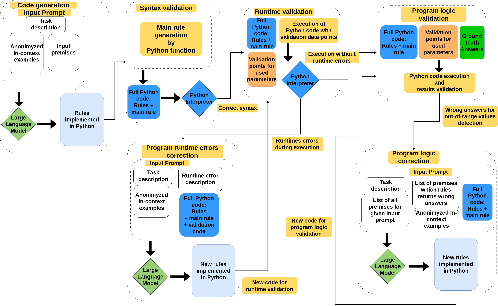

# LLM-Python: Large Language Models for Python code generation for out-of-range values detection
This repository contains code implementation for the [paper]().

## Repository structure
The repository structure look as follow:
- data - directory with all data used for experiments described in the paper
- outputs - contains outputs generated by examined models
- results - contains reports describing performance of each examined models
- templates - contains used prompts and ground truth rules

## Proposed pipeline
The pipeline describing the flow of the whole experiment is seen below:

## Results

### Task1

### First iteration - accuracy metrics table
| Model Name | Formalization | Correctness | Overall |
| ---------- | ------------- | ----------- | ------- |
| `Llama-70B`| 1.0 | 1.0 | 1.0 |
| `Llama-8` | 1.0 | 0.84 | 0.84 |
| `Mistral` | 0.98 | 0.5 | 0.49 |
| `Gemma` | 0.91 | 0.51 | 0.47 |
| `Qwen` | 0.98 | 0.28 | 0.28 |
| `Mixtral` | 0.07 |0.82 | 0.06 |

### Rules correction - accuracy metrics table
| Model Name | Formalization | Correctness | Overall |
| ---------- | ------------- | ----------- | ------- |
| `Llama-70B`| - | - | - |
| `Llama-8` | - | - | - |
| `Mistral` | - | - | - |
| `Gemma` | - | - | - |
| `Qwen` | - | - | - |
| `Mixtral` | - | - | - |

### Task2

### First iteration - accuracy metrics table
| Model Name | Formalization | Correctness | Overall |
| ---------- | ------------- | ----------- | ------- |
| `Llama-70B`| 1.0 | 0.27 | 0.27 |
| `Llama-8` | 0.99 | 0.21 | 0.20 |
| `Mistral` | 1.0 | 0.05 | 0.05 |
| `Gemma` | 1.0 | 0.15 | 0.15 |
| `Qwen` | 0.99 | 0.02 | 0.02 |
| `Mixtral` | 0.99 |0.04 | 0.04 |

### Runtime correction - accuracy metrics table
| Model Name | Formalization | Correctness | Overall |
| ---------- | ------------- | ----------- | ------- |
| `Llama-70B`| 1.0 | - | - |
| `Llama-8` | 1.0 | 0.22 | 0.22 |
| `Mistral` | 0.98 | - | - |
| `Gemma` | 0.91 | - | - |
| `Qwen` | 0.98 | - | - |
| `Mixtral` | 0.99 | - | - |

### Rules correction - accuracy metrics table
| Model Name | Formalization | Correctness | Overall |
| ---------- | ------------- | ----------- | ------- |
| `Llama-70B`| 1.0 | - | - |
| `Llama-8` | 1.0 | 0.23 | 0.23 |
| `Mistral` | 0.98 | - | - |
| `Gemma` | 0.91 | - | - |
| `Qwen` | 0.98 | - | - |
| `Mixtral` | 0.07 | - | - |