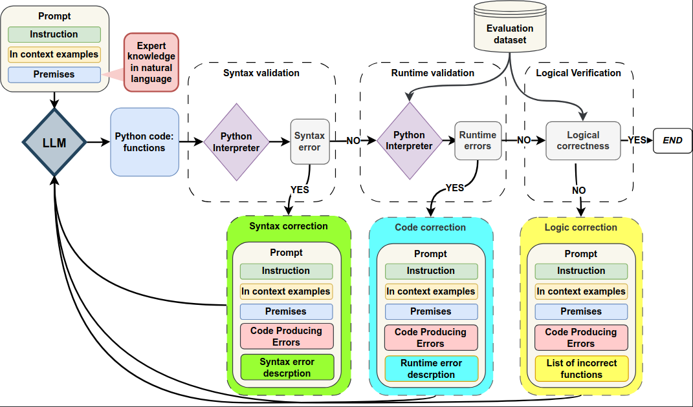
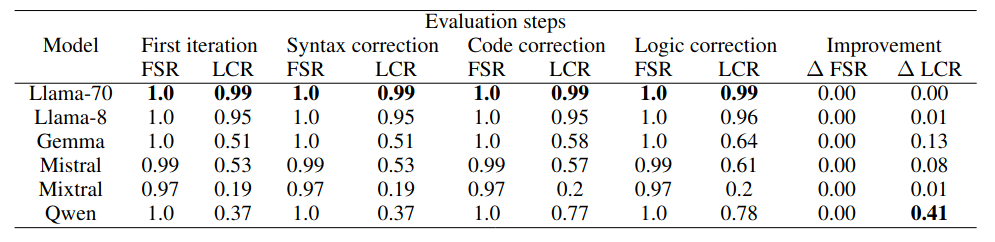
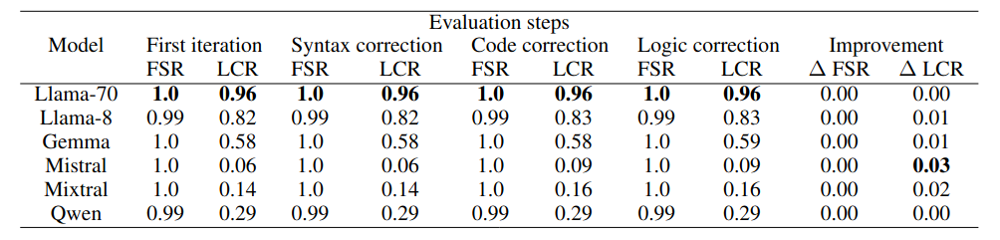

# Integrating Expert Knowledge into Logical Programs via LLMs
This repository contains code implementation for the [paper](https://arxiv.org/abs/2502.12275).



## Repository structure
The repository structure look as follow:
- `data` - directory with all data used for experiments described in the paper
    - Prompts dataset for Task 1: `dataset_premises.csv`
    - Prompts dataset for Task 2: `upgraded_task2_dataset_premises.csv`
    - Points dataset for Task 1: `points_dataset.csv`
    - Points dataset for Task 2: `task2_points_dataset.csv`
    - File with all statements for Task 1: `statements.csv`
    - File with all statements for Task 2: `Task2_conditions_updated.csv`
    - File wth all parameters: `parameters.csv`
- `outputs` - contains outputs generated by examined models
    - `Python_task1` - outputs from Task 1
    - `Python_task2` - outputs from Task 2
- `results` - contains reports describing performance of each examined models. It included separate folder for each step of inference, with separate folder for each task
    - `first_iter` - reports with results of evaluation after first inference
    - `syntax` - reports with results of evaluation after syntax correction
    - `runtime` - reports with results of evaluation after program correction
    - `critic_rules` - reports with results of evaluation after logic correction
- `metrics` - contains reports describing performance of each examined models
- `templates` - contains used prompts and ground truth rules
    - `gt_rules` - two Python files with ground truth rules for each task, used for generating anonymyzed In-context examples
    - `prompts` - prompts for all refinement steps

## Experiments:
### Setup
Main packages needed for running a repo:
```
- Python==3.10
- transformers==4.43.1
- accelerate==0.33.0
- tqdm==4.66.1
- pandas==2.2.0
- torch==2.1.2
- seaborn==0.13.2
- CUDA==12.1
```

To install python libraries:
```console
pip install -r requirements.txt
```

### Running a code
To run an experiment's script (e.g. task1 first inference):
```console
python main_python.py --model model_name
```
Possible models names:
- Llama-70
- Llama-8
- Mixtral
- Mistral
- Qwen
- Gemma

### Task 1 - scripts

- For first inference: `main_python.py`
- For syntax correction: `main_critic_task1_python_suntax.py`
- For code correction: `main_critic_task1_python_runtime.py`
- For logic correction: `main_critic_task1_python_rules.py`

### Task 2 - scripts

- For first inference: `task2_main_python.py`
- For syntax correction: `main_critic_task2_python_suntax.py`
- For code correction: `main_critic_task2_python_runtime.py`
- For logic correction: `main_critic_task2_python_rules.py`

### Evaluation
To run an evaluation script:
```console
python evaluation_python.py --task Task1 --step first --refinement False
```
Where parameters could be:

- **task** - *Task1* or *Task2*
- **step** - *first*, *syntax*, *runtime* or *logic*
- **refinement** - *True* or *False* whether it is initial inference or one of the refinements steps

## Results

### Results report structure
| Prompt | Premises | No. of parameters | Parameters | Model | Model output | Syntax eval | Out-of-range | Out-of-range detection |
| -------- | ------- | -------- | ------- | -------- | ------- | -------- | ------- | -------- |
| Whole input prompt given to the model | Listed premises based on which the model was to generate the code | Number of parameters / conditions in a prompt | The listed parameters, appearing in the premises given to the input| Name of the model | Output generated by the model | Result of the syntaz evaluation - *correct syntax* if correct, error message otherwise | A ground truth answer for detection of out-of-range value | Results of the evaluation returned by a generated code |

### Task 1 - Range checking



### Task 2 - Constraint validation

