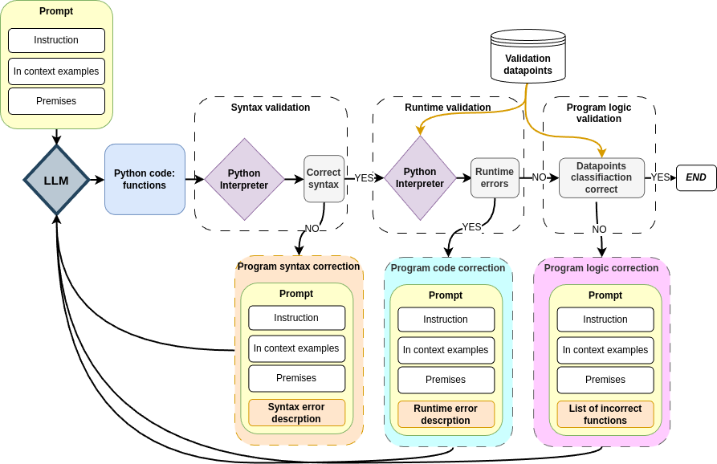

# PyLogExKn: Evaluating Expert Knowledge Integration in Python-Based Logical Rules
This repository contains code implementation for the [paper]().



## Repository structure
The repository structure look as follow:
- `data` - directory with all data used for experiments described in the paper
    - Prompts dataset for Task 1: `dataset_premises.csv`
    - Prompts dataset for Task 2: `upgraded_task2_dataset_premises.csv`
    - Points dataset for Task 1: `points_dataset.csv`
    - Points dataset for Task 2: `task2_points_dataset.csv`
    - File with all statements for Task 1: `statements.csv`
    - File with all statements for Task 2: `Task2_conditions_updated.csv`
    - File wth all parameters: `parameters.csv`
- `outputs` - contains outputs generated by examined models
    - `Python_task1` - outputs from Task 1
    - `Python_task2` - outputs from Task 2
- `results` - contains reports describing performance of each examined models. It included separate folder for each step of inference, with separate folder for each task
    - `first_iter` - reports with results of evaluation after first inference
    - `syntax` - reports with results of evaluation after syntax correction
    - `runtime` - reports with results of evaluation after program correction
    - `critic_rules` - reports with results of evaluation after logic correction
- `metrics/Python` - contains reports describing performance of each examined models
- `templates` - contains used prompts and ground truth rules
    - `gt_rules` - two Python files with ground truth rules for each task, used for generating anonymyzed In-context examples
    - `prompts` - prompts for all refinement steps

## Experiments:
### Setup
```console
pip install -r requirements.txt
```

To run an experiment's script (e.g. task1 first inference):
```console
python main_python.py --model model_name
```
### Task 1 - scripts

- For first inference: `main_python.py`
- For syntax correction: `main_critic_task1_python_suntax.py`
- For code correction: `main_critic_task1_python_runtime.py`
- For logic correction: `main_critic_task1_python_rules.py`

### Task 2 - scripts

- For first inference: `task2_main_python.py`
- For syntax correction: `main_critic_task2_python_suntax.py`
- For code correction: `main_critic_task2_python_runtime.py`
- For logic correction: `main_critic_task2_python_rules.py`

## Results

### Task 1 - Range checking


### Task 2 - Constraint validation

